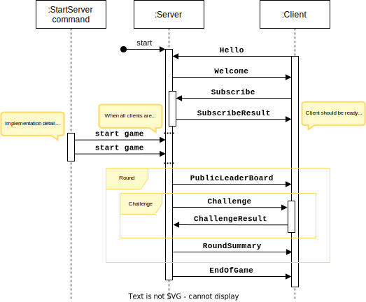
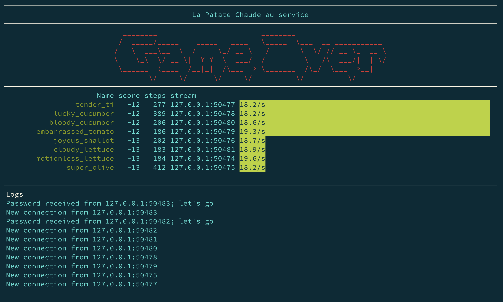

# Projet Rust: *la Patate Chaude* <br> Architecture des Logiciels - 4<sup>ème</sup> année - ESGI

---

**Flash news**: la [FAQ](FAQ.md)

---

Vous connaissez peut-être [l'expression](https://fr.wiktionary.org/wiki/patate_chaude)
ou [le jeu](https://www.momes.net/jeux/jeux-exterieur/courses-relais-rapidite/patate-chaude-842114) de la *patate
chaude*.

En quelques mots: comment se débarrasser d'un objet gênant avant qu'il ne soit trop tard !

Le projet est ici d'élaborer une version numérique de ce jeu où l'apothéose sera quand tous vos projets joueront
ensemble une grande partie sur le réseau pour déterminer qui est le plus fiable, le plus rapide ou le plus malin.

Le jeu est composé de:

* un ou plusieurs agents "joueurs" (que nous nommerons aussi "client" pour coller au vocabulaire usuel au niveau
  technique)

* un agent "arbitre" (que nous nommerons aussi "serveur")

La partie se déroule ainsi:

1. Le serveur démarre; après initialisation, il écoute sur un port (7878 par défaut).

2. Les différents clients démarrent alors et entrent en relation avec le serveur suivant un protocole décrit plus loin.

3. Une fois que les clients se sont connectés, une commande sur le serveur scelle le groupe de participants et le
   serveur n'accepte plus de nouveaux entrants. Le jeu peut démarrer.

4. La partie se joue en plusieurs manches (aussi nommées *round*) dont le nombre est défini par la configuration du
   serveur.

   Pour chaque manche:

    1. Le serveur envoie à tous les joueurs actifs, un tableau général des scores de tous les joueurs.

    2. Le serveur détermine (secrètement) le temps alloué pour le prochain *round*. Ce *timer* décompte uniquement le
       temps entre l'envoi (par le serveur) du challenge à un joueur et sa réponse.

    3. Jusqu'à ce qu'un joueur perde:

       (i.e. ne résout pas son challenge dans le délai imparti ou bien la durée du *round*
       est expirée)

        1. Le serveur sélectionne le prochain joueur:
            * tel que désigné par le précédent joueur
            * ou bien choisi au hasard parmi les joueurs encore dans la partie
              (si par exemple le joueur désigné n'est plus actif ou bien si c'est le premier tour).
            * Le serveur se réserve le droit d'y ajouter des règles d'exclusion pour éviter des comportements extrêmes (
              tout
              en restant équitable entre les joueurs dans la partie)

        2. Le serveur envoie au joueur un challenge à résoudre.

        3. Le serveur attend la réponse du joueur jusqu'au *timeout* (défini dans la configuration du server)

            * Si le timer du *round* expire pendant la résolution du *challenge*, le joueur perd 1 point.
            * Si le joueur répond correctement au challenge, alors la *patate* est passée au joueur qu'il désigne
            * Si le joueur ne répond pas correctement, mais avant le *timeout*, il perd un point et reste dans la
              partie.
              Le round s'arrête.
            * Si le joueur ne répond pas avant le *timeout* ou bien qu'il ne répond à la sollicitation de challenge, il
              est exclu des joueurs actifs jusqu'à la fin de la partie. Le *round* s'arrête.

    4. Une fois le *round* terminé (quelque soit la raison), le serveur envoi un résumé du round avec la liste des
       joueurs ayant participé (dans l'ordre des joueurs ayant participé au *round*) avec pour chacun
        * son nom
        * son résultat
            * s'il a réussi (avec sa durée d'exécution et sa prochaine cible)
            * ou bien s'il n'a pas réussi (avec sa durée d'exécution et sa prochaine cible)
            * ou bien s'il a été timeout
            * ou bien s'il n'est plus accessible (et donc exclu des joueurs actifs)

En fin de partie, le ou les vainqueurs sont identifiés. Il existe deux manières de *scorer*:

* avoir le plus de plus de points
* avoir résolu le plus de challenges

## Les challenges

C'est ici que l'ingéniosité algorithmique et l'efficacité dans la mise en œuvre vont être décisifs.

Tout challenge doit respecter l'interface imposée par le `trait` suivant:

```rust
trait Challenge {
    /// Données en entrée du challenge
    type Input;
    /// Données en sortie du challenge
    type Output;
    /// Nom du challenge
    fn name() -> String;
    /// Create a challenge from the specific input
    fn new(input: Self::Input) -> Self;
    /// Résout le challenge
    fn solve(&self) -> Self::Output;
    /// Vérifie qu'une sortie est valide pour le challenge
    fn verify(&self, answer: &Self::Output) -> bool;
}
```

Différents challenges pourront être requis pour le jeu.

Le premier challenge est le *HashCash*; au moins un autre challenge sera à définir collectivement.

1. [`HashCash` : le challenge de preuve de travail](md5-hashcash.md)

1. [`MonstrousMaze` : le challenge d'évasion](monstrous-maze.md)

1. [`RecoverSecret` : le challenge de décodage](recover_secret.md)

1. Nonogram solver (à qualifier plus tard)

1. Bloxorz Solver (à qualifier plus tard)

## Votre objectif

* Réaliser un client écrit en Rust sans bibliothèque extérieure autres que celles autorisées.

  **C'est la partie principale du projet.**

* Réaliser un serveur minimal qui permette de tester un client (pas besoin d'interface TUI ou GUI, même si ma démo peut
  le suggérer; ce peut être fait en "bonus").

* Il ne doit pas y avoir de duplication de code entre le client et le serveur. Vous définirez un "crate" pour:
    * Le client
    * Le serveur
    * Les éléments communs au client et au serveur

## Les modalités de réalisation

* Le projet doit être traité par groupe de 2 ou 3 personnes

* Le code doit remis sous Git (github ou gitlab).

  Le projet Git devra être créé à partir d'un *fork* du projet portant le sujet (et n'oubliez pas de m'en donner l'accès en lecture).

* Le code doit être fonctionnel sous Linux, macOS et Windows

* Le code devra être raisonnablement testé (par des tests unitaires et des tests d'intégration)

* Le code devra suivre les règles de codage défini par `rustfmt`

* Le code devra être documenté avec `rustdoc`

* La documentation devra être intégrée au dépôt du code et écrite au format Markdown.

* Les seuls modules (*aka* crates) autorisés ici sont:
    * `rand`
    * `clap`
    * `serde`

Le jour de la soutenance orale, vous serez évalués sur:

* Le respect des consignes
* La fiabilité et le respect du protocole entre client et serveur
* Le respect des idiomes Rust (dont la gestion des erreurs)
* L'organisation et la lisibilité du code
* Il y aura une note collective et une note individuelle.
* La doc Markdown doit mettre en évidence
    * Votre organisation du travail en tant qu'équipe
    * Votre démarche d'élaboration des différents composants du projet
    * Les spécificités de votre projet (i.e. ce qui n'est pas déjà dans le sujet)
    * Vos éventuels bonus (parmi la liste présentée ou bien d'autres si validés au préalable par l'enseignant)

      Les bonus ne sont pris en compte uniquement si le client "joueur" est fonctionnel (fonctionnement raisonnablement
      sans planter dans des situations "normales" de jeu). Le niveau minimal fonctionnel du client et du serveur (en
      mode test de votre client) défini la note de 10/20.

## Bonus possibles:

* Réaliser une interface pour le client et/ou le serveur
* Ajouter une intégration continue qui permette de tester votre code client et serveur (sous GitHub ou GitLab)
* Employer une stratégie de jeu pour maximiser les *chances* de victoires d'un joueur

  Cela peut être une stratégie locale au joueur ou bien en interaction avec les autres joueurs

* Déployer des techniques avancées pour optimiser la performance de résolution du challenge
* Réussir à faire *crasher* le serveur de référence

NB: Pour les *Bonus*, vous avez le droit d'employer des modules (*aka* crates) additionnels.

## Aide à la mise au point

* Un serveur de référence sera distribué sous forme compilé pour tester vos clients.

## Le protocole d'échange

Tous les messages se passent sur un flux TCP qui doit rester ouvert pendant toute la durée de la partie (et fermer *
proprement* en fin de partie).

Toute rupture de connexion entraîne le retrait du joueur de la liste des joueurs actifs (et donc fini les chances de
victoire).

Tous les messages sont de la forme:

| JSON message size          | JSON message     |
|----------------------------|------------------|
| (u32 encodé en Big Endian) | (encodé en utf8) |

### Les messages possibles:

| Nom du message      | Champs du message                                             | Exemple                                                                                                                                                                                                                                                                                                        |
|---------------------|---------------------------------------------------------------|----------------------------------------------------------------------------------------------------------------------------------------------------------------------------------------------------------------------------------------------------------------------------------------------------------------|
| `Hello`             |                                                               | `"Hello"`                                                                                                                                                                                                                                                                                                      |
| `Welcome`           | `version: u8`                                                 | `{"Welcome":{"version":1}}`                                                                                                                                                                                                                                                                                    | 
| `Subscribe`         | `name: String`                                                | `{"Subscribe":{"name":"free_patato"}}`                                                                                                                                                                                                                                                                         | 
| `SubscribeResult`   | `enum { Ok, Err(SubscribeError) }`                            | `{"SubscribeResult":{"Err":"InvalidName"}}`                                                                                                                                                                                                                                                                    | 
| `PublicLeaderBoard` | `Vec<PublicPlayer>`                                           | `{"PublicLeaderBoard":[{"name":"free_patato","stream_id":"127.0.0.1","score":10,"steps":20,"is_active":true,"total_used_time":1.234},{"name":"dark_salad","stream_id":"127.0.0.1","score":6,"steps":200,"is_active":true,"total_used_time":0.1234}]}`                                                          | 
| `Challenge`         | `enum { ChallengeName(ChallengeInput) }`                      | `{"Challenge":{"MD5HashCash":{"complexity":5,"message":"Hello"}}}`                                                                                                                                                                                                                                             | 
| `ChallengeResult`   | `result: ChallengeAnswer`<br/>`next_target: String`           | `{"ChallengeResult":{"answer":{"MD5HashCash":{"seed":12345678,"hashcode":"68B329DA9893E34099C7D8AD5CB9C940"}},"next_target":"dark_salad"}}`                                                                                                                                                                    | 
| `RoundSummary`      | `challenge: String`<br/>`chain: Vec<ReportedChallengeResult>` | `{"RoundSummary":{"challenge":"MD5HashCash","chain":[{"name":"free_patato","value":{"Ok":{"used_time":0.1,"next_target":"dark_salad"}}},{"name":"dark_salad","value":"Unreachable"}]}}`                                                                                                                        | 
| `EndOfGame`         | `leader_board: PublicLeaderBoard`                             | `{"EndOfGame":{"leader_board":[{"name":"free_patato","stream_id":"127.0.0.1","score":10,"steps":20,"is_active":true,"total_used_time":1.234},{"name":"dark_salad","stream_id":"127.0.0.1","score":6,"steps":200,"is_active":true,"total_used_time":0.1234}]}}`                                                 | 

### Séquencement des messages




### Les types additionnels:

| Nom du type               | Description du type                                                                                                                                                                                           |
|---------------------------|---------------------------------------------------------------------------------------------------------------------------------------------------------------------------------------------------------------|
| `SubscribeError`          | `enum { AlreadyRegistered, InvalidName }`                                                                                                                                                                     |
| `PublicPlayer`            | `name: String`<br/>`stream_id: String `<br/>`score: i32 `<br/>`steps: u32 `<br/>`is_active: bool`<br/>`total_used_time: f64 `                                                                                 |
| `ChallengeAnswer`         | `enum { ChallengeName(ChallengeOutput) }`                                                                                                                                                                     |
| `ChallengeResult`         | `name:  ChallengeAnswer`<br/>`next_target: String`                                                                                                                                                            |
| `ChallengeValue`          | `enum {`<br/>`  Unreachable,`<br/>`  Timeout,`<br/>`  BadResult { used_time: f64, next_target: String },`<br/>`  Ok { used_time: f64, next_target: String }`<br/>` }` |
| `ReportedChallengeResult` | `name: String,`<br/>`value: JobValue`                                                                                                                                                                         |
| `PublicLeaderBoard`       | `.0: Vec<PublicPlayer>`                                                                                                                                                                                       |

### Quelques exemples de captures d'écran de la version de référence.




<!-- for PDF export using pandoc
---
title: "Project Rust"
subtitle: "Architecture des logiciels - 4ème année - ESGI"
author: Pascal HAVÉ \<training+esgi@haveneer.com\>
date: 26 avril 2022
geometry: "left=1cm,right=1cm,top=1cm,bottom=2cm"
output: pdf_document
---
-->