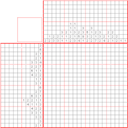

(https://en.wikipedia.org/wiki/Nonogram)

### NonogramSolver : le challenge de l'image mystère

En entrée du challenge, soient:

* `rows` et `cols`: deux tableaux de tableaux d'entiers de type `u32`

L'objet est du challenge est de reconstituer une *image* sous forme d'une grille de pixels blancs ou noirs.

Pour chaque ligne (tableau `rows`; respectivement pour chaque colonne -- tableau `cols`), la séquence de nombres indique
la taille des différents blocs de cases noires disjoints présents sur la ligne (et toujours pris dans l'ordre
d'apparition, de gauche à droite pour les lignes et de haut en bas pour les colonnes).

Tout le défi est de bien placer ces blocs noirs sur la ligne (et donc de déduire l'emplacement des cases blanches).

La réponse au challenge prend la forme d'une chaine de caractères.

| grid     |
|----------|
| `String` |

Par exemple, pour l'entrée

| rows               | cols               |
|--------------------|--------------------|
| `[[0,2],[],[0,3]]` | `[[0,2],[],[0,3]]` |

Nous devrions avoir la solution:

| grid            |
|-----------------|
| `# #\n   \n# #` |

Ce qui donne de manière *bien formattée*:

```
│   │
│ # │
│   │
```

(le caractère `│` est autorisé comme délimiteur)

## Table des symboles de la grille

| Symbole                 | signification                              |
|-------------------------|--------------------------------------------|
| ` `                     | case blanche                               |
| `#`                     | case noire                                 |
| `│`                     | délimiteur de formattage (optionnel)       |
| `?`                     | case non définie (intermédiaire de calcul) |

## Structures de données en entrée / sortie

```rust
pub struct NonogramSolverInput {
    pub rows: Vec<Vec<u32>>,
    pub cols: Vec<Vec<u32>>,
}

pub struct NonogramSolverOutput {
    pub grid: String,
}
```

## Exemples:

### Exemple non trivial

```
rows: [[2], [2], [1], [1], [1, 3], [2, 5], [1, 7, 1, 1], [1, 8, 2, 2], [1, 9, 5], [2, 16], [1, 17], [7, 11], [5, 5, 3], [5, 4], [3, 3], [2, 2], [2, 1], [1, 1], [2, 2], [2, 2]]
cols: [[5], [5, 3], [2, 3, 4], [1, 7, 2], [8], [9], [9], [8], [7], [8], [9], [10], [13], [6, 2], [4], [6], [6], [5], [6], [6]]
```

donne la solution:

```
┌────────────────────┐
│  ##                │
│ ##                 │
│ #                  │
│ #                  │
│ #     ###          │
│##    #####         │
│#    #######   #   #│
│#    ########  ## ##│
│#   #########  #####│
│##  ################│
│ # #################│
│ ####### ###########│
│  #####   ##### ### │
│  #####   ####      │
│   ###     ###      │
│   ##      ##       │
│  ##        #       │
│  #         #       │
│  ##        ##      │
│  ##        ##      │
└────────────────────┘
```

### Résolution animée



## Remarques pas tout à fait inutiles

* Il peut parfois y avoir plusieurs solutions valides; trouvez-en juste une pour résoudre le challenge.
* L'augmentation de complexité portera sur la taille de la grille et la proportion de cases blanches
* Les niveaux de 0 à 3 sont des grilles fixes (toujours les mêmes); à partir de 4, ce sont des grilles aléatoires de complexité croissante.
* Il existe beaucoup de littérature et d'algorithmes pour la résolution des Nonogrammes. Vous n'avez pas besoin d'en créer un original. Vous trouverez aussi facilement des sites pour tester des grilles.

  Ex:
  * https://www.nonograms.org 
  * http://a.teall.info/nonogram/
  * https://activityworkshop.net/puzzlesgames/nonograms/tutorial.html
  * https://gambiter.com/puzzle/Nonogram.html
  * https://nonograms-katana.fandom.com/wiki/Tips_for_solving
  * https://www.researchgate.net/publication/303313197_New_Technique_To_Solve_Nonogram_Puzzle_Problem_With_Quake_Algorithm